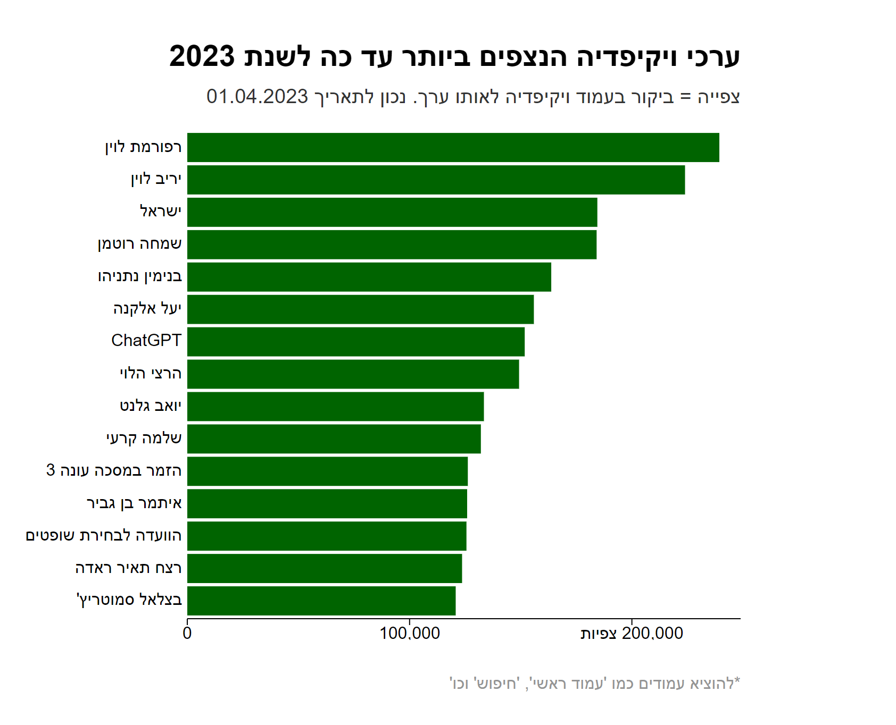

Template from Connor's [Svelte template](https://github.com/connorrothschild/iib-svelte-workshop-template)

## Start the development server

Run `npm run dev` to start the development server.

Or, see the output below:

